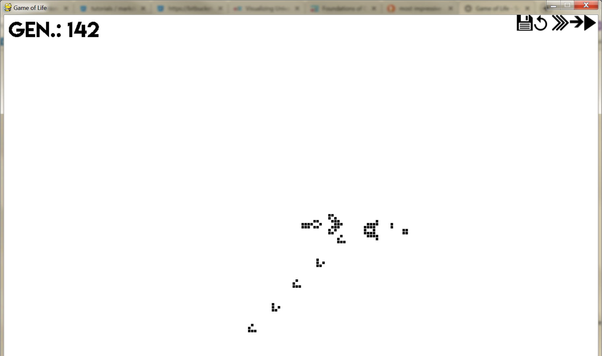

## Conway's Game of Life

This is an implementation of Conway's [Game of Life](https://en.wikipedia.org/wiki/Conway%27s_Game_of_Life) in Python and Pygame. (*Built in 2017*)




## Running the game
### Windows
If you're on Windows, simply download and run [gol_installer.msi](./gol_installer.msi). This will install the game at a destination of your choice.

### Other platforms
If you're running the game on a platform other than Windows, or if you simply don't want to install the game, you'll need to have a local installation of [Python](https://www.python.org/downloads/) and additionally install [Pygame](https://www.pygame.org/wiki/GettingStarted#Pygame%20Installation). Then from the command line you can run:
```
python View.py
```
## Controls
Using the UI buttons, the simulation can be started, restarted, accelerated, decelerated, or iterated through.

Pre-set configurations can be found in the [configs](./configs) folder and can be loaded while the program is running by clicking on the disk button.

**NOTE:** At the moment, the configuration file to be loaded is hardcoded and must therefore be changed manually by adjusting the configuration file path in [View.py](./View.py) if another configuration file should be loaded. 


## Creating Custom Configurations

A configuration file is a simple text file consisting of asteriks `*` and dots `.`, where an asterik denotes that the corresponding cell will
be occupied and a dot denotes that the cell will be empty. 

The number of overall characters (i.e. `.` and `*`) need not correspond 
to the number of cells in the grid. However, to ensure an accurate representation of the configuration on the grid, the characters need to be
placed correctly relative to each other as they are intended to be seen on the grid.

For examples on how a configuration file is structured, take a look in the [assets](./assets) folder.
